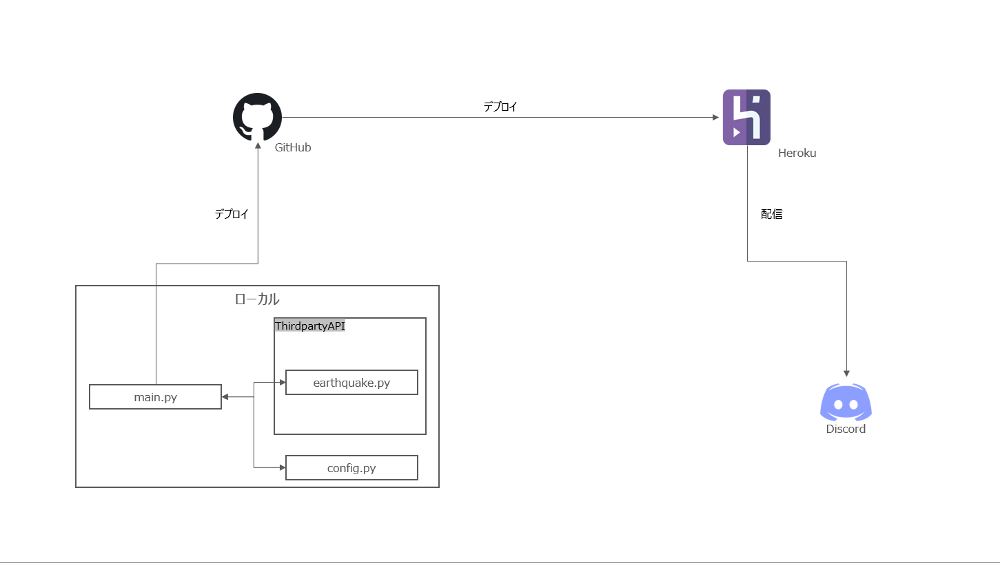

# Discord EEW Bot


<br>


To read in English, please refer [README_EN.md](./README_EN.md).

Discord EEW Botのインベントリページです。なお、このDiscord EEW Botは日本の緊急地震速報のみ通知します。<br>

## 仕様

Discord EEW BotはHerokuを使用しています。構成は以下の通りです。


### 機能
Discord EEW Botには以下の機能があります。
1. 震度5弱以上の地震が発生した場合、Embedで配信

### 使用方法（コード）
Config/config.pyにAPIのURLやHerokuに登録した環境変数の環境変数名を記載しています。<br>
APIのURLが変更になった場合、異なる環境変数名を使用する場合はこちらのファイルを編集ください。<br>
Herokuの環境変数登録方法は[こちら](https://devcenter.heroku.com/articles/config-vars#using-the-heroku-dashboard)を参照ください。<br>

### 使用API
|#|API名|URL|
|:-:|:-|:-|
|1|緊急地震速報 JSON API (Ver.Beta)|https://api.iedred7584.com/eew/|

APIを使用するにあたり、各API提供元の制約を遵守ください。<br>

### 注意事項
本Botのコードを全て、または一部修正して使用する場合、以下の内容をライセンスとして挿入ください。
```
Code provided by Hipro
https://github.com/Hipro-Official
```

また、本Botの[config.py](Config/config.py)を除くファイルのコードを変更して不具合等が発生した場合、Hiproでは責任を一切負いかねますので予めご了承下さい。<br>
不具合等ございましたら、Issueに起票いただけますと幸いです。

### License
GNU GENERAL PUBLIC LICENSE v3.0